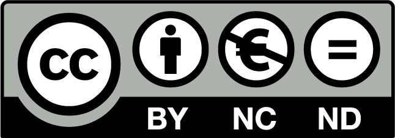

```diff
  An updated will be released soon
```
# License



- [More info about CC license](./images/cc-license.png)

# Arduino UNO

Different codes and assemblies using the Arduino UNO board will be collected in this repository.
<H1 align="center">  </H1>

### Author
Jorge Miguel González Novez  |  _Technician in Electrotechnical and Automated Systems_

## Datasheet  
- [Arduino UNO Datasheet](arduino-UNO-datasheet.pdf)

## A bit of theory  
- [Theory](THEORY.md)  

## Materials 
TO-DO
- [Materials](./docs/materials.md)

## Examples  

- [Impulse switch](/src/impulse-switch)  
- [7 segment display](/src/7-segment-display) | TO-DO

### Liability

**I am not responsible for the inappropriate use of the information shown here.  
As well as for any accident caused by the incorrect use of the materials and/or tools.**
