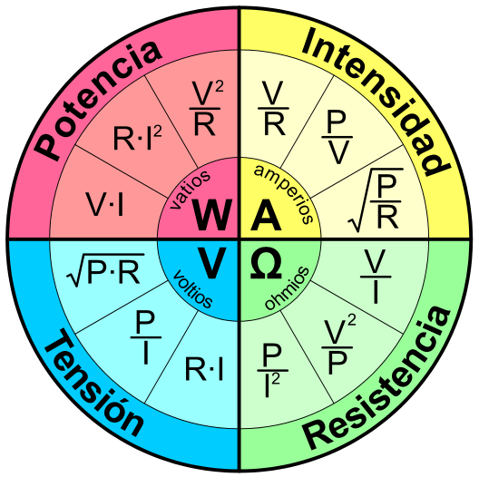
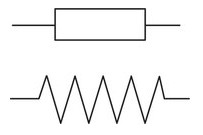
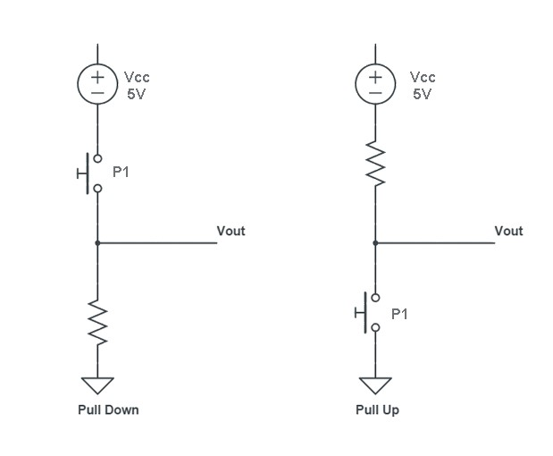
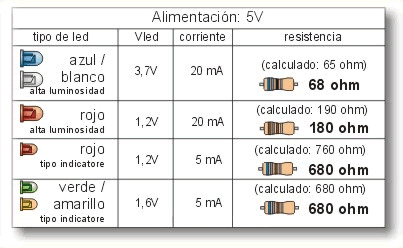
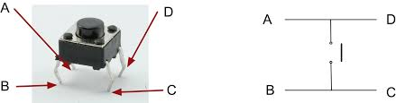

## Ohm´s Law  
The first, and perhaps most important, the relationship between current, voltage, and resistance is called Ohm’s Law, discovered by Georg Simon Ohm and published in his 1827 paper.  
_The Galvanic Circuit Investigated Mathematically_.  

  

## Resistor  
Is an electrical device that opposes the flow of current. Its value is measured in ohms (Ω).  

  
  

## Resistivity  
It describes the behaviour of a material when faced with the electric current flow, so it gives an idea of how good or bad a conductor it is.  
A high resistivity value indicates that the material is a poor conductor, while a low value will indicate that it is a good conductor.  
It is usually designated by the lower case Greek letter rho (ρ) and is measured in ohms per meter (Ω m).  

  

## Pull Down & Pull Up Resistor  

  
  

When making our circuits, we find components that work in two states: HIGH or LOW.  
These ranges present a zone of uncertainty, in which the electronic noise can generate erroneous readings.  
To avoid these erroneous readings, we use the pull up or pull down resistance.  

  - __Pull Up__: When the circuit is at rest, the voltage drop on the board is 5V(HIGH), but when the button is pressed, all the current is diverted to ground, 0V(LOW).  
                 Normally 10K resistor will be used.  
  - __Pull Down__: When the circuit is at rest, the voltage drop on the board is 0V(LOW), but when the button is pressed, the voltage drop drops to 5V(HIGH).  
                 Normally 10K resistor will be used.  
                 
 ## LED (Light Emitting Diode)  
 
 
  
   

  
  

## Four terminal push button  

  
 

## Source  
- https://www.fisic.ch/contenidos/electricidad/ley-de-ohm-y-resistencia/  
- http://slotsyrockolas.blogspot.com/p/el-led.html
